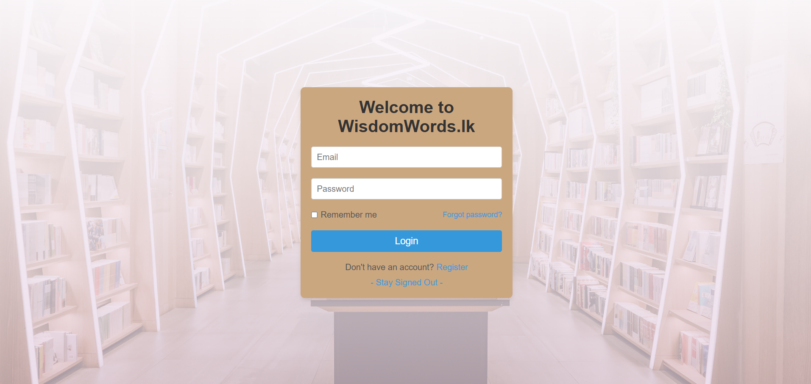
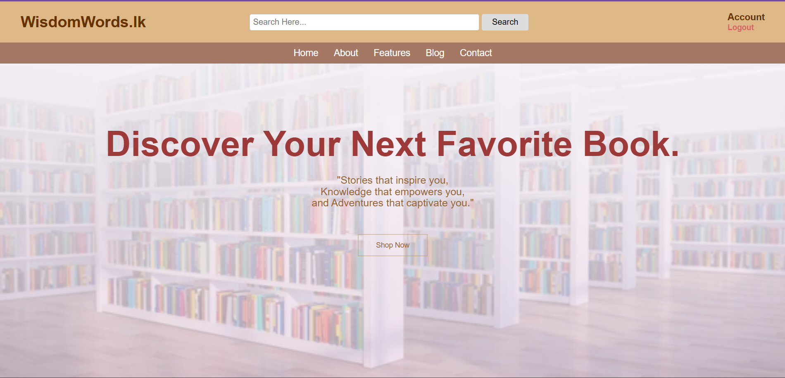
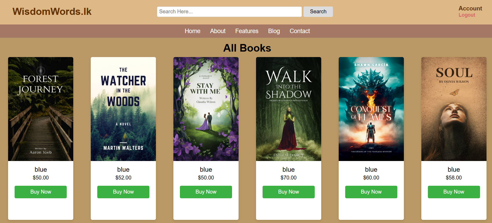
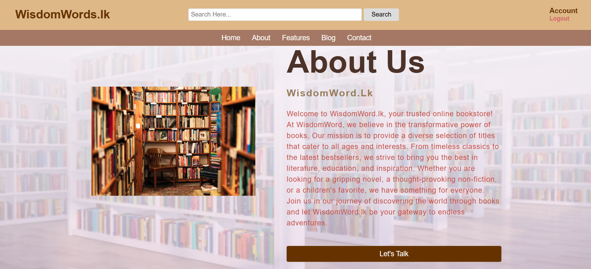
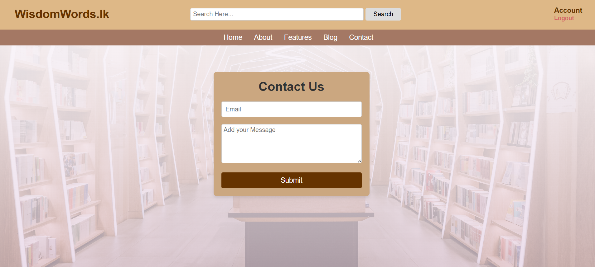

WisdomWords Bookstore — Ecommerce Website 💻📚

This is a simple and complete online bookstore project developed as part of my first-year coursework.  
It includes both frontend and backend development using the following technologies:

🛠 Technologies Used:
- HTML, CSS, JavaScript
- PHP and MySQL
- AJAX (for dynamic frontend-backend communication)

📁 Project Structure:
- `/product` — Frontend pages (home, book listings, cart)
- `/wadphp2` — PHP backend (database connections, login/register, admin panel)

✅ Features:
- User Registration & Login
- Add to Cart & Checkout
- Book Listing with Search
- Admin Control Panel
- Responsive Design

📷 View:

- Login Page

- Home Page

- Shop Now Page

- About Us Page

- Contact Us Page

📌 How to Run Locally:
1. Place the project in your `htdocs` (if using XAMPP)
2. Import the SQL file to your database (e.g., phpMyAdmin)
3. Edit `config.php` with your DB credentials
4. Run `localhost/wadphp2/index.php` in your browser

